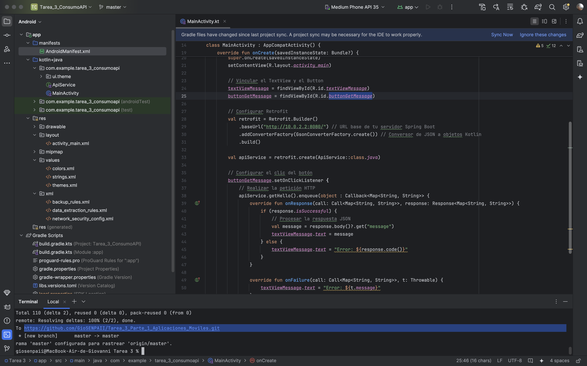
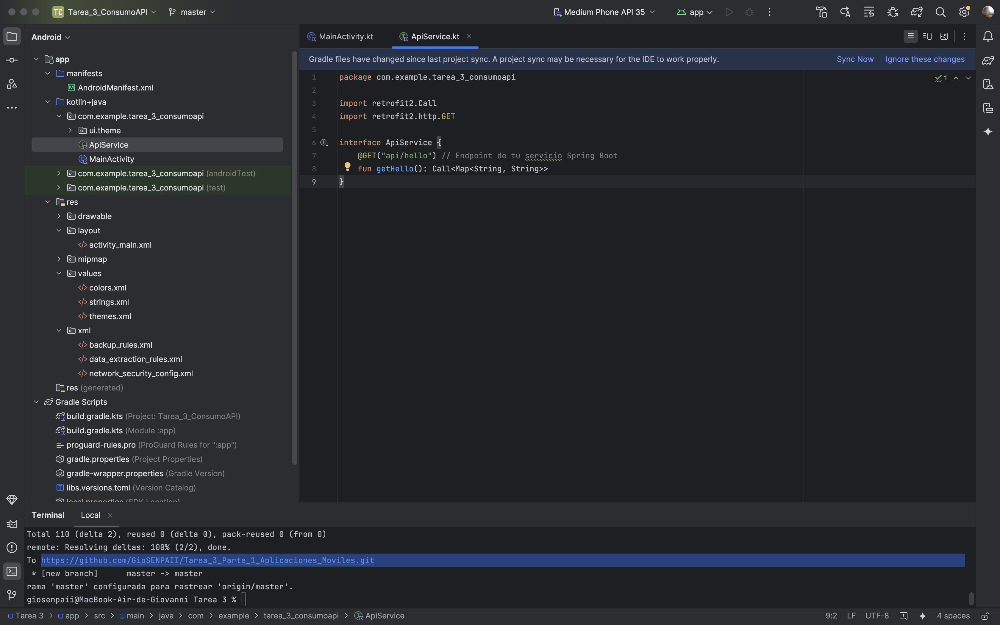
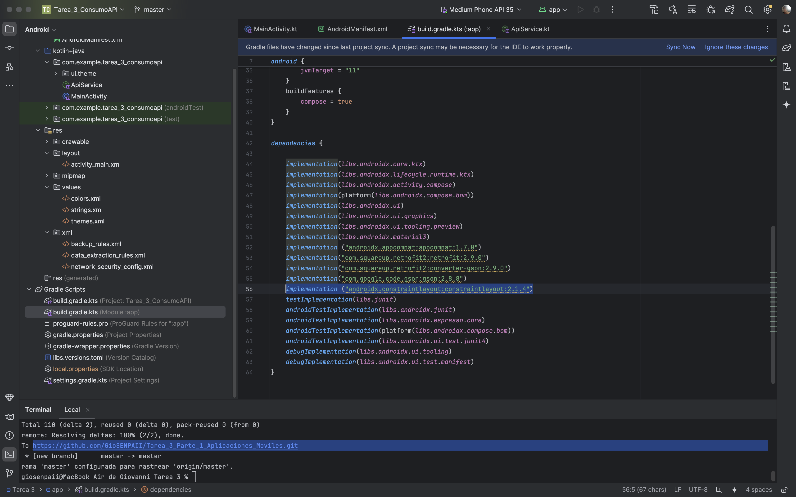
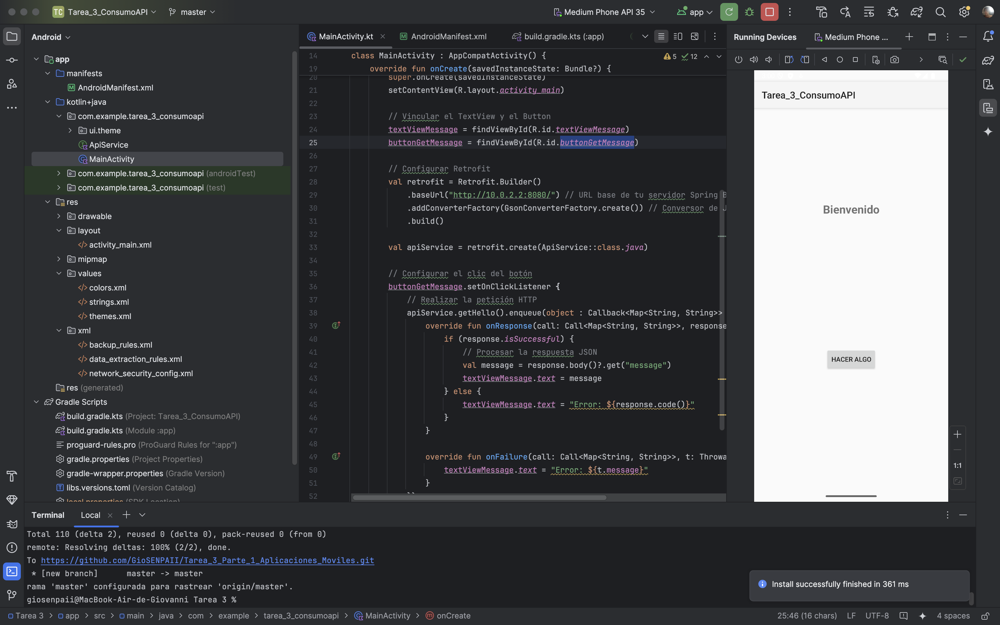
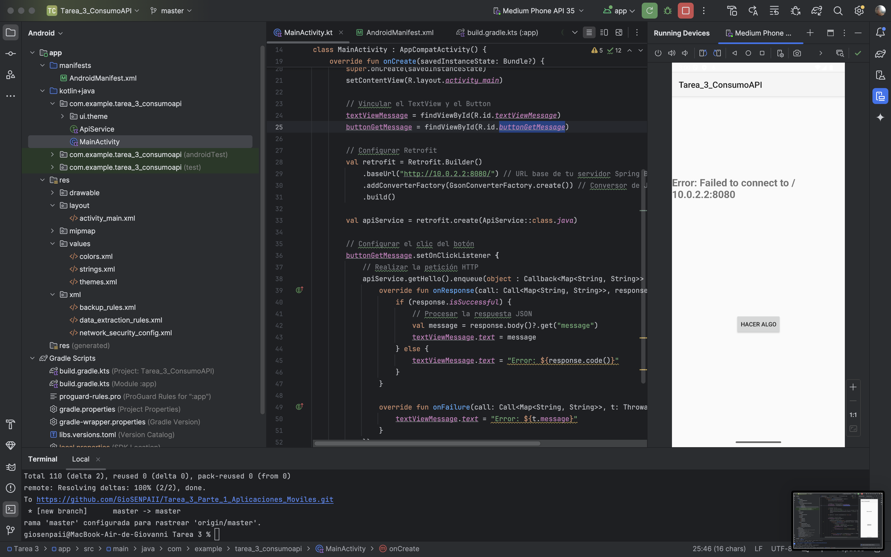
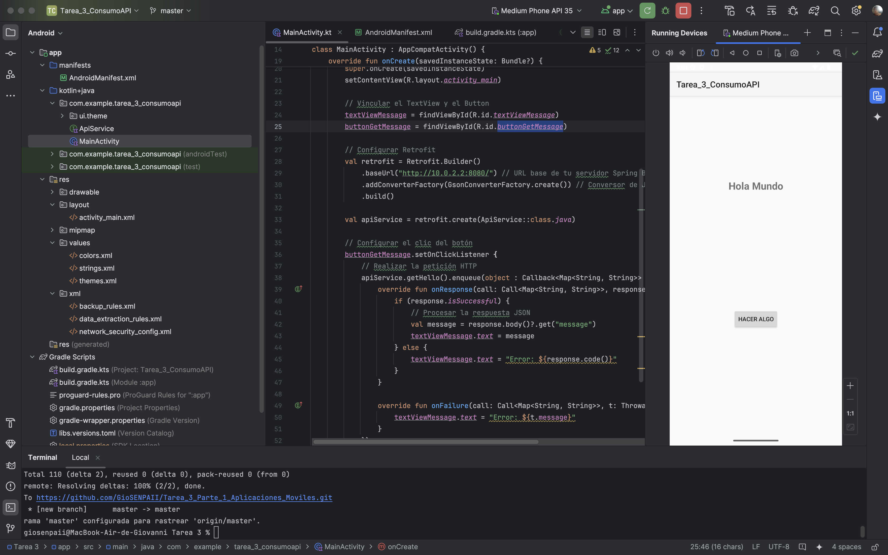

# Aplicación Android con Spring Boot

## Descripción del Proyecto
Este proyecto consiste en una aplicación Android que consume un servicio REST básico implementado con Spring Boot. La aplicación se conecta al backend para obtener un mensaje simple en formato JSON y lo muestra en la interfaz de usuario.

---

## Instrucciones de Configuración y Ejecución

### Backend (Spring Boot)
1. **Clona el repositorio**:
   ```bash
   git clone https://github.com/tu-usuario/tu-repositorio-spring.git
   cd tu-repositorio-spring
   ```

2. **Configura el proyecto**:
   - Abre el proyecto en tu IDE favorito (IntelliJ IDEA, Eclipse, etc.).
   - Asegúrate de tener **Java JDK 11 o superior** instalado.

3. **Ejecuta el servidor Spring Boot**:
   - Ejecuta la clase principal `DemoApplication.java`.
   - El servidor estará disponible en `http://localhost:8080`.

4. **Verifica el endpoint**:
   - Accede a `http://localhost:8080/api/hello` en tu navegador para confirmar que el servidor está funcionando. Deberías ver una respuesta JSON como:
   
   ```json
   {
     "message": "Hola Mundo"
   }
   ```

---

### Aplicación Android

1. **Clona el repositorio**:
   ```bash
   git clone https://github.com/tu-usuario/tu-repositorio-android.git
   cd tu-repositorio-android
   ```

2. **Abre el proyecto en Android Studio**:
   - Importa el proyecto en **Android Studio**.
   - Sincroniza las dependencias de **Gradle**.

3. **Configura la seguridad de red**:
   - Asegúrate de que el archivo `network_security_config.xml` esté configurado para permitir conexiones a localhost (`10.0.2.2`).
   - Ubicación: `res/xml/network_security_config.xml`
   - Contenido:
   
   ```xml
   <?xml version="1.0" encoding="utf-8"?>
   <network-security-config>
       <domain-config cleartextTrafficPermitted="true">
           <domain includeSubdomains="true">10.0.2.2</domain>
       </domain-config>
   </network-security-config>
   ```

4. **Ejecuta la aplicación**:
   - Conecta un dispositivo físico o inicia un emulador.
   - Ejecuta la aplicación desde **Android Studio**.
   - Presiona el botón "Obtener Mensaje" para realizar la petición al servidor Spring Boot.

---

## Arquitectura de la Aplicación

- **Backend**: Spring Boot expone un endpoint REST (`/api/hello`) que devuelve un mensaje en formato JSON.
- **Frontend**: La aplicación Android consume el endpoint usando **Retrofit** y muestra el mensaje en un `TextView`.

---

## Desafíos Encontrados y Soluciones

### 1. Permisos de red en Android
**Problema**: La aplicación no tenía permisos para acceder a Internet.
**Solución**: Se añadió el permiso en `AndroidManifest.xml`:
```xml
<uses-permission android:name="android.permission.INTERNET" />
```

### 2. Conexión a localhost en el emulador
**Problema**: El emulador no podía acceder al servidor Spring Boot en `localhost`.
**Solución**: Se configuró `network_security_config.xml` para permitir conexiones a `10.0.2.2`.

### 3. Manejo de errores
**Problema**: La aplicación no manejaba adecuadamente los errores de red.
**Solución**: Se implementó un manejo de errores en **Retrofit** para mostrar mensajes descriptivos.

---

## Dependencias Utilizadas

- **Spring Boot**: Para implementar el backend REST.
- **Retrofit**: Para consumir el servicio REST en la aplicación Android.
- **Gson**: Para convertir la respuesta JSON en objetos Kotlin.
- **AndroidX**: Para componentes de la interfaz de usuario.

---

## Capturas de Pantalla










---

## Autor
- **Giovanni Javier Longoria Bunosut** -


